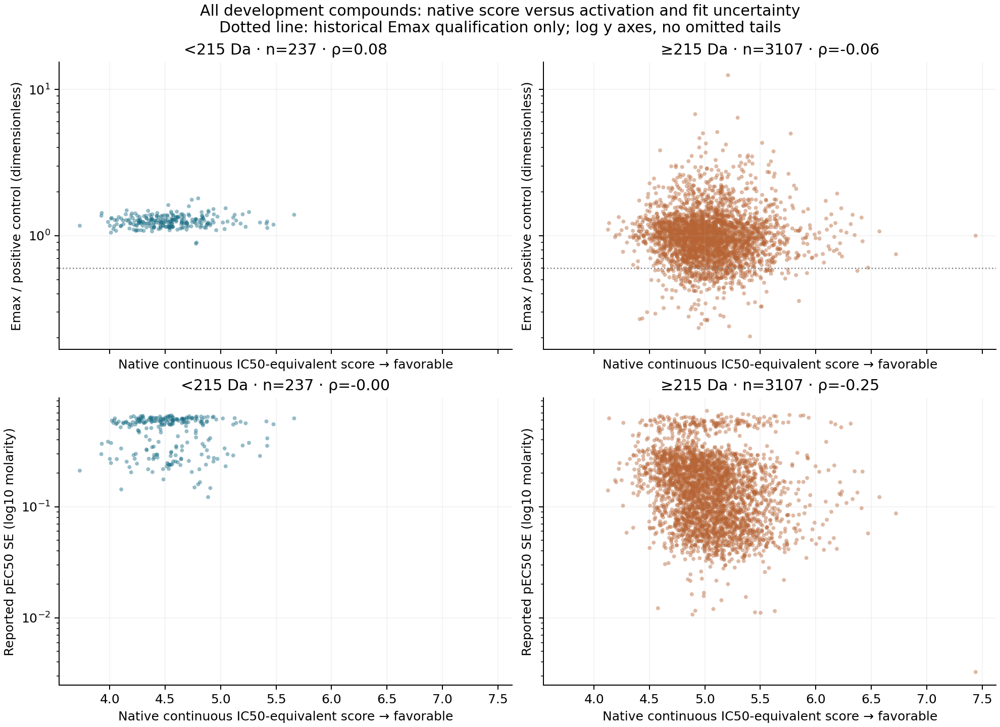
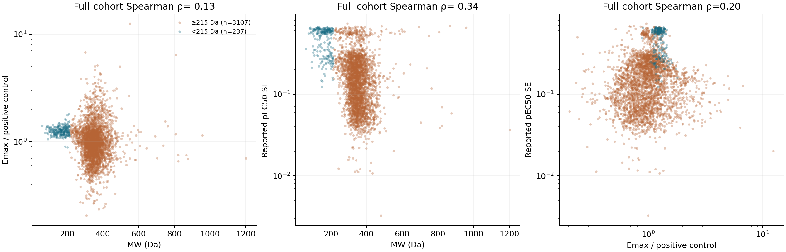

# PXR native-score, molecular-weight and efficacy diagnostic

This retrospective study tests whether small molecules receiving favorable native Nesso scores have lower activation efficacy or less precisely resolved activation curves. **The uncertainty explanation is supported descriptively; lower positive-control-normalized Emax is not.** No predictor was fitted or rerun.

Created and last edited: 2026-09-08 (UTC). Exploratory development-cohort analysis, not new validation.

## Results

| Quantity (median unless indicated) | <215 Da | ≥215 Da |
|---|---:|---:|
| Compounds | 237 | 3,107 |
| Saved chemical groups represented | 114 | 1,907 |
| Emax / positive control, dimensionless | 1.240 | 0.977 |
| Emax, log2 fold change versus baseline | 2.170 | 2.530 |
| Reported pEC50 standard error | 0.558 | 0.141 |
| Reported normalized Emax standard error | 0.457 | 0.173 |
| Reported raw Emax standard error | 0.375 | 0.187 |
| Assay pEC50 | 2.45 | 4.70 |
| Native IC50-equivalent score | 4.533 | 5.014 |
| Historical normalized Emax ≥0.6 qualification | 237/237 | 2,835/3,107 |

The small-minus-large median difference is **+0.263** for normalized Emax (95% group-bootstrap interval **+0.249 to +0.301**) and **+0.417** for pEC50 SE (**+0.398 to +0.432**). These are marginal, exploratory intervals from 1,000 draws of the saved chemical groups, conditional on this cohort and the already completed systems. Groups can span both MW strata; group counts are not additive. No confirmatory p-values are claimed.

The efficacy conclusion depends on normalization: small molecules have *higher* normalized Emax but *lower* baseline-relative log2 Emax. Neither scale alone justifies calling these compounds nonactivators. The positive-control denominator and the actual observed curve plateau cannot be reconstructed from these summary fields. All small molecules pass the existing normalized-Emax qualification. The data therefore weaken the proposed **low normalized efficacy** explanation rather than confirming binding without activation.



## Comparing similar native-score ranges

The intersection of the two observed score ranges is **4.126392–5.663596**: **217/237 small** and **3,001/3,107 larger** molecules remain. Within it, the normalized-Emax median difference is **+0.262** (interval **+0.249 to +0.301**) and the SE difference is **+0.420** (**+0.398 to +0.434**). Restricting to this range does not match score distributions; it only removes unsupported tails.

Fixed 0.5-unit native-score bins give more local comparisons (all bins, including empty-stratum tails, are in [score_bins.csv](artifacts/score_bins.csv)):

| Native score range | Small / large n | Normalized Emax medians, small / large | SE medians, small / large |
|---|---:|---:|---:|
| [4.0, 4.5) | 104 / 75 | 1.240 / 1.030 | 0.564 / 0.223 |
| [4.5, 5.0) | 111 / 1,418 | 1.250 / 0.992 | 0.564 / 0.166 |
| [5.0, 5.5) | 17 / 1,365 | 1.230 / 0.947 | 0.412 / 0.119 |
| [5.5, 6.0) | 1 / 216 | 1.390 / 0.972 | 0.623 / 0.109 |

The last bin has only one small molecule and is not reliable evidence about favorable-score tails. No favorable-score cutoff or potency cutoff was selected.

Continuous MW correlates with normalized Emax at Spearman **−0.134**, and with pEC50 SE at **−0.342**. After descriptive rank adjustment for native score these become **−0.093** and **−0.247**. After additionally adjusting for pEC50 they shrink to **−0.017** and **−0.090**. Potency and fit uncertainty are strongly entangled (pEC50–SE rho **−0.858**); this adjustment is not causal, and conditioning on a jointly fitted endpoint can obscure as well as clarify relationships. Small molecules also have less favorable native scores on average, despite their strong overprediction relative to their much lower cellular pEC50.



## What the saved corrections show

For the 500-label saved systems, downward correction means **native minus adapted prediction**, so positive values lower the predicted potency. It correlates with SE at **0.279** for head-only and **0.460** for head-plus-LoRA. After rank adjustment for MW, native score and pEC50, these become **0.013** and approximately **0.000**. At 100 labels, the corresponding unadjusted correlations are **0.266 / 0.408**, and adjusted correlations **−0.046 / −0.063**. Normalized-Emax correlations are also small after adjustment. The correction is associated with the same size/potency/uncertainty structure; this is not evidence that an adapter independently learned efficacy or curve quality. No efficacy-selected performance claim or model refitting was performed.

## Assay meaning and selection

The provider describes an **8-point cellular chimeric PXR-LBD/luciferase reporter assay**, not a direct binding measurement. Curves were empirically classified for activity and rollover, then fit using a product of two three-parameter models (EC50, Emax and Hill slope for activation and rollover), with classification-constrained EC50 and negative-control mean as baseline. The primary screen advanced hits with log2 fold change >1 and FDR <5% at the lowest tested dose, supplemented by analogs and an additional diversity set. That single-point hit rule is **not an Emax cutoff**.

pEC50 is −log10 EC50 in molar units; Emax is response magnitude, not potency. The source provides both baseline-relative **log2 fold change** and **dimensionless positive-control-normalized Emax**, each with SE and reported confidence bounds. The retrieved provider documentation does not specify the positive-control compound, denominator calculation or batch-level normalization sufficiently to independently reconstruct it. Ratios above one are retained, not clipped or relabeled percentages. The `OCNT Batch` field is unique per compound here (3,344 values), and cannot serve as a shared assay-plate adjustment. No plate effect was inferred from its name.

Emax SE and pEC50 SE are strongly associated (rho **0.801** for normalized Emax SE and **0.880** for raw Emax SE). Joint parameter fitting, dose-range coverage, constraints, rollover and biological response can all contribute. Larger SE supports less precise fitted potency, but cannot distinguish flat nonactivation from extrapolation or other curve problems. A true nonactivator has no defined activation EC50: a low numeric pEC50 in this table does not prove nonactivation or censoring.

The exact cohort is the saved **3,344 development identities**, not an Emax-refiltered sample: **3,072 historical Emax-qualified plus 272 lower-Emax records**. Qualification is reconstructed exactly as normalized Emax ≥0.6 versus the manifest's historical role. The broader local raw table has 4,139 rows; curation retains 4,134 after five named exclusions ([audit](artifacts/audit.json)); the historical role allocation reserves 790 records outside development. Those records and opened challenge/external sets were not used as fresh validation. Current selection therefore does not exclude the 272 lower-Emax development compounds, but it remains conditional on the upstream selected, QC-passed DRC population with fitted potency labels. It is not representative of all screened compounds or all binders.

**Material missing evidence:** no dose-by-dose response traces, per-curve replicate counts, curve classification, rollover/censor flags, posterior parameter covariance, control measurements, or row-level interference/cytotoxicity flags are present in the primary summary table used here. The provider FAQ notes revised confidence intervals for multiply replicated compounds, without giving those replicate counts here. No raw-curve refit or mechanistic inference is possible from this packet.

## Identity and scalar provenance

Saved development IDs → prepared label/feature-row map → modeling manifest → raw molecule-name and OCNT identity → source efficacy/SE fields. The merged table preserves identities, SMILES, roles, raw confidence bounds, chemistry, scalar scores, chemical groups and each saved head/LoRA prediction once per compound.

The native scalar is exactly the `fresh_features/native_points.npy` used by the MW controls: **6 minus the FP32 arithmetic mean of the two continuous member outputs**, with higher scores more favorable on an IC50-equivalent scale. The cached `scalar_features` member values reconstruct it exactly, and saved native held-out predictions match exactly. This is numerical scale alignment, not biological equivalence to cellular EC50. MW is the historical identity-SMILES molecular weight; independent RDKit recomputation agreed exactly. The chemistry report's native scalar differs by at most 0.000000954; it was not substituted for the authoritative array.

Native binary probability is retained separately as the arithmetic mean of sigmoid-transformed **same-packet** cached member logits, along with both logits. An older binary-report packet was also inspected and preserved under explicitly historical columns: its continuous scalar differs by >0.00001 on 3,342 compounds, maximum 0.703409. It is not silently equated to the current native packet. Neither binary probability nor favorable continuous affinity proves binding.

All primary numerical fields have **3,344/3,344 coverage and no missing values**. There are 1,975 saved chemical groups, 1,458 singleton groups and a largest group of 36 compounds. Bootstrap resampling preserves group membership and multiplicity, not independence of molecules within groups.

## Reproduction and artifacts

From `/home/dan/projects/nesso-finetune`:

```bash
/home/dan/swr/miniconda3/envs/cheminf/bin/python PXR/experiments/20260908_PXR-MW-efficacy-diagnostic/run.py
/home/dan/swr/miniconda3/envs/cheminf/bin/python PXR/experiments/20260908_PXR-MW-efficacy-diagnostic/verify.py
/home/dan/swr/miniconda3/envs/cheminf/bin/python PXR/experiments/20260908_PXR-MW-efficacy-diagnostic/render.py
```

The verifier independently recomputes median contrasts, every pairwise rank correlation and partial ranks using QR projection; checks source hashes and identity/qualification assertions; and reruns analysis into a temporary directory, requiring **byte-identical tables, JSON and both PNGs**. Four tests passed. Both real PNGs were visually inspected: full tails retained, shared facet scales readable, no clipping observed. HTML is generated from this canonical editable README; no separate narrative is maintained. CPU numerical pools are capped at one thread; no GPU, cloud, inference or historical model refit was used.

- [Frozen exploratory protocol](protocol.json)
- [Exact merged compound table](artifacts/merged_compounds.csv)
- [Primary group-bootstrap contrasts](artifacts/primary_contrasts.csv)
- [Stratum distributions](artifacts/stratum_summaries.csv)
- [Full continuous associations](artifacts/associations.csv)
- [Adjusted and saved-correction associations](artifacts/adjusted_and_correction_associations.csv)
- [Input hashes](artifacts/source_hashes.json), [coverage/identity audit](artifacts/audit.json), [verification receipt](verification.json)
- [Provider documentation URLs and snapshot hashes](documentation/sources.json)

**Completion scope:** a completed, source-bound retrospective descriptive study. It supports an association between low MW and higher fitted-curve uncertainty, exposes normalization-dependent efficacy behavior, and does not establish binding without activation or a causal explanation for adaptation gains.
