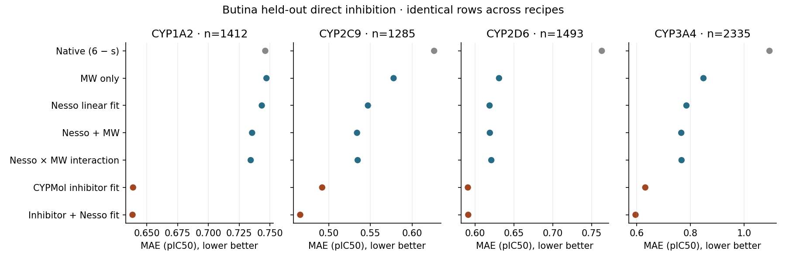
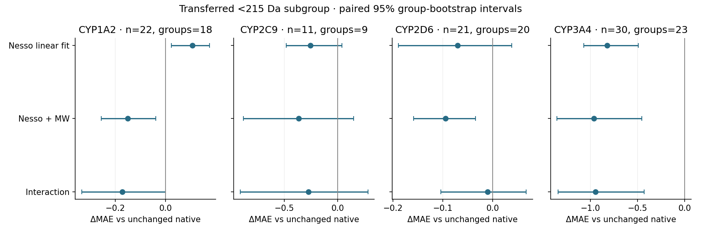

# Four-CYP Nesso score and molecular-weight controls

Created and last edited: 2026-09-08 UTC.

This exploratory case study fits simple molecular-weight controls around saved native Nesso affinity scores to predict four direct-inhibition pIC50 assays. **MW provides a small additional gain for CYP2C9 and CYP3A4, not a general replication of PXR's small-molecule correction. The interaction does not outperform the additive control consistently, and none of these controls rivals the same-CYP inhibitor baseline overall.**

## Model and training

Exact authoritative identity SMILES → existing strict RDKit parser → continuous molecular weight (Da). Previously executed Nesso protein/ligand/heme inference → saved native scalar s. These unchanged inputs → training-fold scaling → challenge-fitted OLS intercept/slopes → held-out assay prediction. Only the scalar mapping was fitted; no encoder, native head or representation was changed.

The largest control is `prediction = b0 + b1*z(s) + b2*z(MW) + b3*z(s*MW)`, with each z based only on its training fold. Smaller controls omit terms. The interaction has four coefficients; it is not MW alone. s remains native log10(IC50/µM), lower stronger; the single conversion `6-s` is used only as the unchanged-native diagnostic on a p-scale. It does not equate Nesso affinity evidence with an assay-calibrated potency. CYPMol inhibitor uses the exact same-CYP native inhibitor probability, linearly mapped to pIC50.

Unpenalized OLS, unrestricted signs, no grid or clipping. Historical Nesso-only, inhibitor-only and inhibitor+Nesso fits were reused after exact train/test membership and numerical replay checks; three MW-containing recipes were newly fitted. Both five-fold splits are reused development evaluations. Butina is primary: radius-2 chiral 2048-bit Morgan, distance 0.60 (similarity 0.40), reordering=True, seed 42. Whole clusters and exact chemical identities remain together. Centroid clustering is not strict pairwise separation.

## Assay uncertainty policy

**Equal weights in both fitting and primary MAE.** All 6,525 matched endpoint observations have supplied bounds and `_std`, with no reversed bounds or point estimates outside their intervals. The dataset README documents 95% CI and std, not per-observation sampling SE; the mixed prepared field name `assay_std_or_se` is not authority to relabel direct-assay std. Replicate counts/SE conversion and explicit censoring direction or assignment flags are absent. Bounds are asymmetric. No justified row-level SE was established, so neither CI/3.92, std-as-SE nor a PXR precision floor is used. All original values are preserved; this is uncertainty availability, not calibrated precision weighting. See [coverage/uncertainty audit](artifacts/coverage_uncertainty.csv).

No universal direct-assay potency cutoff was justified from these sources, so PXR's pIC50=4 split was not imported. The 215 Da cutoff is a transferred descriptive threshold only, never a fitted/tuned rule. Low MW and low potency are not interchangeable.

## Results and discussion

Primary metric is pooled held-out mean absolute error in pIC50 units (lower better). Every recipe uses identical source-scoreable rows within each endpoint: 1,412 / 1,285 / 1,493 / 2,335, with no labelled-row exclusions. All comparisons are on those same training and test cohorts.

### Butina primary

| isoform | native | mw | nesso | additive | interaction | inhibitor | inhibitor_nesso |
|---|---|---|---|---|---|---|---|
| CYP1A2 | 0.7461 | 0.7471 | 0.7433 | 0.7355 | 0.7343 | 0.6389 | 0.6385 |
| CYP2C9 | 0.6264 | 0.5778 | 0.5471 | 0.5340 | 0.5348 | 0.4923 | 0.4659 |
| CYP2D6 | 0.7632 | 0.6309 | 0.6188 | 0.6191 | 0.6210 | 0.5908 | 0.5913 |
| CYP3A4 | 1.0947 | 0.8486 | 0.7851 | 0.7660 | 0.7669 | 0.6318 | 0.5955 |



| isoform | comparison | ΔMAE [95% interval] |
|---|---|---|
| CYP1A2 | additive_minus_nesso | -0.0079 [-0.0158, +0.0005] |
| CYP1A2 | interaction_minus_additive | -0.0011 [-0.0034, +0.0010] |
| CYP1A2 | additive_minus_mw | -0.0116 [-0.0242, +0.0002] |
| CYP2C9 | additive_minus_nesso | -0.0131 [-0.0201, -0.0060] |
| CYP2C9 | interaction_minus_additive | +0.0007 [-0.0006, +0.0028] |
| CYP2C9 | additive_minus_mw | -0.0438 [-0.0573, -0.0309] |
| CYP2D6 | additive_minus_nesso | +0.0003 [-0.0032, +0.0041] |
| CYP2D6 | interaction_minus_additive | +0.0019 [+0.0002, +0.0036] |
| CYP2D6 | additive_minus_mw | -0.0118 [-0.0202, -0.0038] |
| CYP3A4 | additive_minus_nesso | -0.0191 [-0.0267, -0.0118] |
| CYP3A4 | interaction_minus_additive | +0.0010 [+0.0002, +0.0019] |
| CYP3A4 | additive_minus_mw | -0.0826 [-0.0997, -0.0668] |

- **CYP1A2:** additive MW reduces Nesso-fit MAE by 0.0079, but the paired interval includes zero. The interaction's additional 0.0011 change is also inconclusive. Low-MW native bias is negative (underprediction), opposite the PXR overprediction story. This is not a shared-direction replication.
- **CYP2C9:** additive MW reduces Nesso-fit MAE by 0.0131; the interval excludes zero. Nesso adds 0.0438 MAE improvement beyond MW alone. Interaction adds no benefit. The low-MW native overprediction is reduced, but only 11 observations in nine groups support that subgroup and its incremental MW interval spans zero.
- **CYP2D6:** MW adds essentially nothing beyond the Nesso linear mapping (+0.0004 MAE). Interaction worsens overall MAE by 0.0019 and low-MW MAE by 0.0847 relative to additive. Nesso does add information beyond MW alone, but this is not a successful interaction correction.
- **CYP3A4:** additive MW reduces Nesso-fit MAE by 0.0191 and beats MW alone by 0.0826. Interaction slightly worsens MAE (+0.0010). Low-MW native overprediction is conspicuous and largely corrected, but the extra MW contribution beyond scalar mapping has an interval spanning zero in this small subgroup.

The low-MW observations number only 22 / 11 / 21 / 30. Their raw native-to-additive corrections are descriptive, not evidence of neural adaptation or a general mechanism. Additive-versus-Nesso low-MW intervals exclude zero only for CYP1A2, where the original error is underprediction, not overprediction. The full-cohort additive benefit for CYP2C9/3A4 remains in the >=215 Da population; it is not driven solely by the small subgroup. [Contribution decomposition](artifacts/mw_contributions.csv) gives subgroup fraction × within-subgroup error change.

All MW controls remain worse than the inhibitor-only baseline overall. For interaction minus inhibitor, MAE gaps are +0.0954 / +0.0425 / +0.0302 / +0.1352, and their paired intervals exclude zero. This rules out calling the simple controls equivalent based only on local subgroup corrections. Historical inhibitor+Nesso retains its separate endpoint-specific result: improvements for CYP2C9/3A4, no clear benefit for CYP1A2/2D6. Those are scalar conditional-information results, not new MW effects and not neural fine-tuning replication.

### Small-molecule behavior

Bias is prediction minus observation; negative means underprediction. Spearman assesses ordering, not calibration.

| isoform | recipe | n | mae | bias | spearman |
|---|---|---|---|---|---|
| CYP1A2 | additive | 22 | 0.538 | -0.167 | 0.300 |
| CYP1A2 | interaction | 22 | 0.515 | 0.015 | 0.138 |
| CYP1A2 | native | 22 | 0.688 | -0.452 | 0.197 |
| CYP1A2 | nesso | 22 | 0.793 | -0.619 | 0.301 |
| CYP2C9 | additive | 11 | 0.775 | -0.027 | 0.391 |
| CYP2C9 | interaction | 11 | 0.869 | -0.162 | 0.355 |
| CYP2C9 | native | 11 | 1.142 | 1.040 | 0.382 |
| CYP2C9 | nesso | 11 | 0.885 | 0.476 | 0.382 |
| CYP2D6 | additive | 21 | 0.393 | 0.153 | 0.449 |
| CYP2D6 | interaction | 21 | 0.477 | 0.242 | 0.306 |
| CYP2D6 | native | 21 | 0.488 | 0.215 | 0.479 |
| CYP2D6 | nesso | 21 | 0.417 | -0.074 | 0.464 |
| CYP3A4 | additive | 30 | 0.687 | -0.224 | 0.336 |
| CYP3A4 | interaction | 30 | 0.706 | -0.246 | 0.332 |
| CYP3A4 | native | 30 | 1.651 | 1.588 | 0.386 |
| CYP3A4 | nesso | 30 | 0.828 | 0.344 | 0.370 |



Intervals use 2,000 paired whole-Butina-group bootstrap resamples, seed 42, row-weighted differences. They condition on saved fits/splits, omit retraining uncertainty and have no multiple-comparison adjustment. Subgroup intervals resample groups represented in that subgroup. Empty per-fold subgroups have no metric row, rather than invented zero errors. The downloadable median-reference pooled Spearman can arise from fold constants and is **not meaningful compound-ranking evidence**; do not interpret it as ranking.

### Random secondary (not pooled with Butina)

| isoform | native | mw | nesso | additive | interaction | inhibitor | inhibitor_nesso |
|---|---|---|---|---|---|---|---|
| CYP1A2 | 0.7461 | 0.7465 | 0.7422 | 0.7341 | 0.7330 | 0.6391 | 0.6382 |
| CYP2C9 | 0.6264 | 0.5774 | 0.5466 | 0.5346 | 0.5353 | 0.4924 | 0.4661 |
| CYP2D6 | 0.7632 | 0.6321 | 0.6206 | 0.6220 | 0.6232 | 0.5904 | 0.5916 |
| CYP3A4 | 1.0947 | 0.8484 | 0.7853 | 0.7665 | 0.7673 | 0.6320 | 0.5958 |

## Limits

These are affinity-to-assay mappings on selected direct-inhibition dose-response observations, not measured binding affinities or TDI predictions. The direct arm lacks NADPH during preincubation, not catalytic readout; CYP1A2/2C9 use EOMCC fluorescence, CYP3A4 DBOMF fluorescence, CYP2D6 dextromethorphan depletion mass spectrometry. Pretrained-model exposure to evaluation chemistry remains unresolved. Many evaluated chemical groups are singletons, especially CYP2D6; group IDs alone do not establish strong unseen-series generalization. Exact endpoint group/singleton counts are in the coverage audit. No external publication or new server was created.

The first pre-fit source comparison exposed historical CSV parsing roundoff: 2,482 of 13,050 split-cohort rows differed by at most 2.220446049250313e-16 from round-trip parsing. It stopped before any fits. The corrected source gate allows absolute 3e-16, preserving historical score values and recipe parity; this is serialization roundoff, not new model inference. The empty stopped directory is retained. Raw source hashes, exact SMILES hashes and native artifact/sequence/heme hashes remain bound.

## Completion and reproduction

**120 new fits + 120 verified reused fits; 104,400 prediction rows; 6,525 distinct compound–endpoint observations from 4,905 compounds.** Both splits are present. All 240 fit states replayed independently by QR; maximum prediction discrepancy 2.66e-14. Metrics, native references, identity/MW joins, roles and 624,000 bootstrap-difference rows were replayed. Fits use at most four CPU threads, no GPU, inference, cloud, blinded labels or submission.

From the repository root:

```bash
/home/dan/swr/miniconda3/envs/cheminf/bin/python experiments/20260908_CYP-Nesso-MW-case-study/run.py --verify
/home/dan/swr/miniconda3/envs/cheminf/bin/python experiments/20260908_CYP-Nesso-MW-case-study/test_case_study.py
```

The fitting command without `--verify` deliberately refuses the existing output root. `report.py` regenerates this canonical README and its compact HTML view from saved results without fitting.

- [Frozen protocol/design](protocol.md)
- [Verification receipt](verification.json) · [Completion inventory](artifacts/completion.json)
- [Full predictions CSV](artifacts/predictions.csv) · [Parquet](artifacts/predictions.parquet)
- [Exact cohorts and source-native metadata](artifacts/cohorts.parquet)
- [Saved fits and exact role IDs](artifacts/fits.json) · [Role audit](artifacts/role_audit.csv)
- [Full/fold/subgroup MAE, rank and bias](artifacts/metrics.csv)
- [Paired contrasts](artifacts/contrasts.csv) · [All bootstrap draws](artifacts/bootstrap_draws.parquet)
- [Pre-fit source/code hashes](artifacts/prefit_binding.json)
