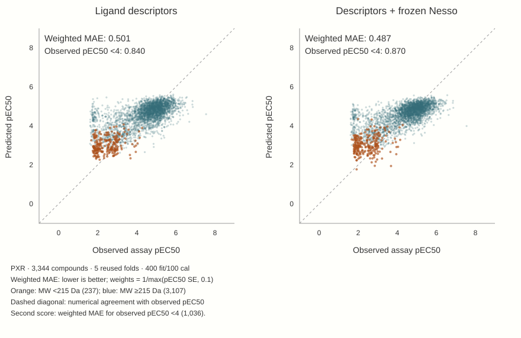

# 3 · Complement, rather than replace, descriptors

The standalone comparison changes the next question. If descriptors already outperform tuned Nesso, the useful test is whether Nesso retains information that descriptors miss. The completed hybrid does this with **frozen native representations**, not LoRA representations.

## Where challenge labels enter

Ligand descriptors feed a fitted LightGBM model. Frozen Nesso affinity representations feed a fitted ridge readout of scaled frozen features. A nested inner selection procedure chooses their mixture within each outer training fold; the outer test compounds do not choose the mixture. The all-fold study preserves the pilot fold and extends the same procedure to four more folds, rather than applying the pilot coefficient everywhere.

<figure class="narrative"><figcaption>The gain is small and the clouds remain similar. The lower overall error comes with worse error below pEC50 4; high-potency underprediction remains.</figcaption></figure>

| Pooled N500 metric | Descriptor | Frozen-feature blend |
|---|---:|---:|
| Weighted MAE ↓ | 0.501 | 0.487 |
| Raw MAE ↓ | 0.600 | 0.595 |
| Spearman rank correlation ↑ | 0.657 | 0.686 |
| Weighted MAE, observed pEC50 ≥4 ↓ | 0.434 | 0.412 |
| Weighted MAE, observed pEC50 <4 ↓ | 0.840 | 0.870 |

Weighted error improves in **all five folds**. Lower-potency weighted error worsens in **every fold**. The below-4 group contains 31% of the compounds but only 16.4% of the evaluation weight, under the assay-SE weighting defined in chapter 1. The weighted objective emphasizes more precise measurements; it does not make the lower-potency penalty irrelevant.

## What the modest win establishes

The frozen representation adds predictive value under this selection and scoring procedure. This is evidence of complementarity in reused development folds, not confirmation on a new assay population. One label draw and seed do not establish stability across label draws.

The choice now depends on the intended objective: broad weighted accuracy, equal-compound error, or performance among active compounds. Keep all three views visible before promoting a model.

[Continue to the efficacy test and conclusion →](../interpretation/index.html)

[All-fold experiment, exact metrics and predictions](../../experiments/hybrid-allfolds/index.html) · [Pilot and nested-selection record](../../experiments/hybrid-pilot/index.html)
