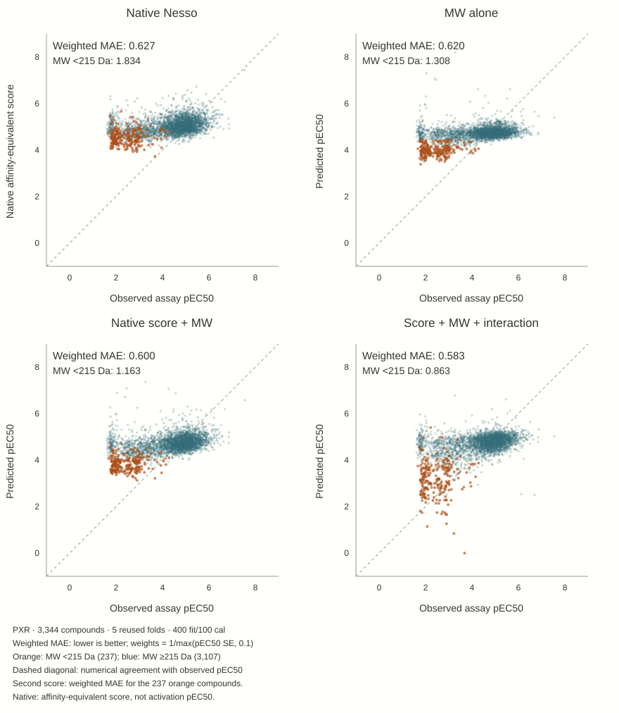

# 2 · Can molecular weight reproduce the correction?

Native Nesso substantially overpredicts the measured potency of small molecules. Among **237 of 3,344 compounds below 215 Da**, the correction from native to LoRA is conspicuous. But a visible correction does not tell us which information was learned—or whether a neural model was necessary.

## Four simple controls distinguish the possibilities

The control experiment reused the exact N500 FIT/CAL/test roles. It fitted unregularized weighted least squares on FIT rows, with continuous predictors standardized using FIT statistics. The objective was weighted squared error, not the neural Huber loss or the reported weighted MAE. No test-selected threshold or extra neural training was used.

- **MW alone:** intercept + molecular weight.
- **Native-score calibration:** intercept + native score.
- **Additive control:** intercept + native score + MW.
- **Interaction:** the additive control plus native score × MW—four coefficients, not “MW alone.”

CAL labels determined residual prediction intervals, not the plotted point predictions. The pre-existing 215 Da boundary is only a diagnostic grouping; each control is a continuous function applied to all molecules.

<figure class="narrative"><figcaption>Adding the native score to MW improves on MW alone; the interaction further reduces small-molecule error. Size helps calibration but is not a complete potency model.</figcaption></figure>

| Below 215 Da · N500 | Weighted MAE ↓ |
|---|---:|
| Native unchanged | 1.834 |
| Native-score calibration | 1.570 |
| MW alone | 1.308 |
| Heads + LoRA | 1.179 |
| Native score + MW | 1.163 |
| Score–MW interaction | 0.863 |
| Ligand descriptors | 0.604 |

The additive control roughly matches LoRA in this subgroup, while the interaction improves further. Descriptors still do better. This narrows the interpretation: the small-molecule correction is not uniquely neural, and adding a simple covariate can repair a substantial systematic bias.

## A subgroup story is not the whole score

Small molecules are a minority of compounds and carry little precision weight. Their improvement is therefore much more visually prominent than its contribution to total weighted error. Low molecular weight is also not the same variable as low observed potency. Neither this control nor LoRA proves that Nesso has learned cellular efficacy.

[Continue: do frozen representations add information beyond descriptors? →](../hybrid/index.html)

[Original MW-control report](../../evidence/reports/architecture/results/mw-controls/index.html) · [Detailed control experiment and exact tables](../../experiments/mw-controls/index.html)
