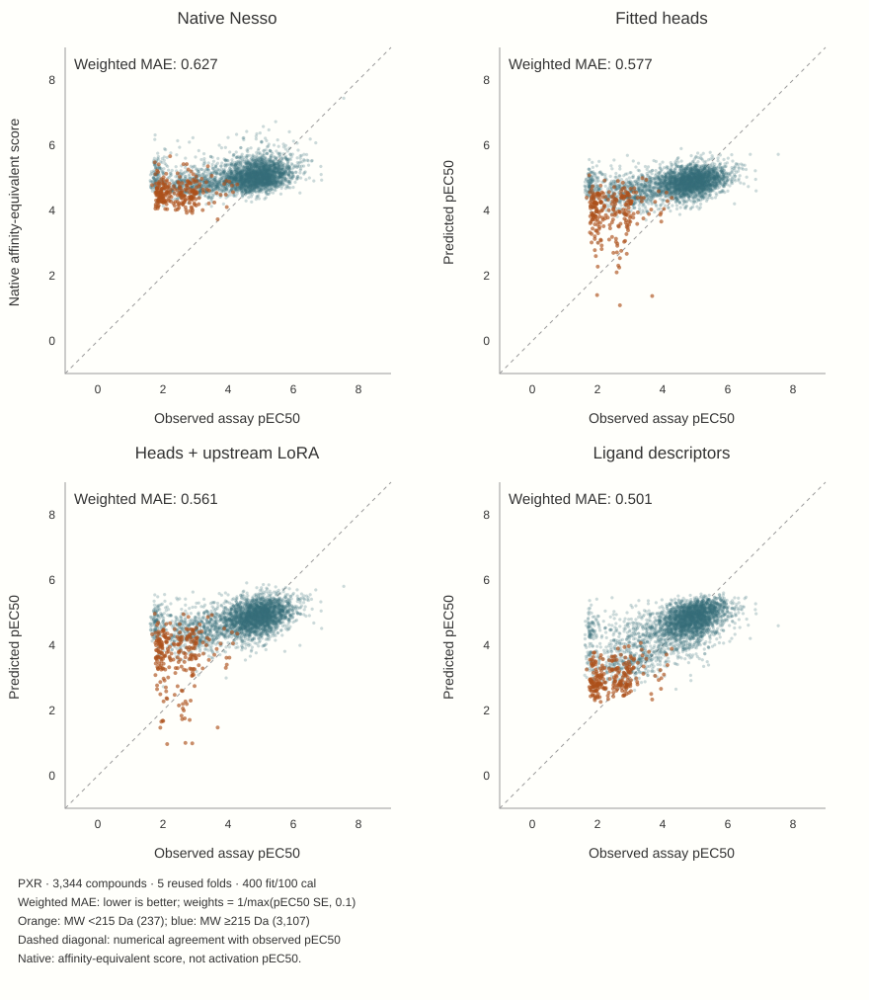

# 1 · From binding features to activation predictions

The first question was practical: can a pretrained protein–ligand affinity model transfer to a chemically diverse cellular PXR activation assay? Rescaling its affinity output puts numbers on a familiar p-scale; it does not turn binding into activation.

## Start with the readout, then change the representation

The initial nested chemical-family comparison fitted Nesso’s final continuous heads on frozen representations. Raw development MAE improved from **0.915 native to 0.633 with fitted heads**, but rich 2D LightGBM reached **0.516**. Readout capacity, loss and learning-rate controls refined the result rather than reversing it. Those historical raw-MAE results are not the later N500 weighted benchmark.

The follow-up tested whether adapting upstream affinity features helped beyond fitting the final heads.

**Matched N500 flow**

- Native: protein + ligand → pretrained Nesso → unchanged continuous score.
- Head-only: frozen upstream features → continuous heads **fitted on PXR labels**.
- LoRA: both affinity members receive **rank-4 adapters fitted on PXR labels**, alongside the same continuous heads. Main trunk and external ESM encoder remain frozen.
- Descriptor reference: ligand RDKit/Mordred/Morgan features → **PXR-fitted LightGBM**.

Both neural arms used **40 full-FIT optimizer updates**. Each N500 fold had 400 FIT + 100 CAL labels; calibration rows supplied residual intervals rather than point-prediction fitting. This was one draw and seed with no tuning of the neural comparison recipe.

<figure class="narrative"><figcaption>Adaptation reduces native overprediction, especially among small molecules. The descriptor reference still has lower overall error; the observed assay values themselves have measurement uncertainty.</figcaption></figure>

| N500 system | Weighted MAE ↓ | Raw MAE ↓ |
|---|---:|---:|
| Native | 0.627 | 0.914 |
| Fitted heads | 0.577 | 0.793 |
| Heads + upstream LoRA | 0.561 | 0.757 |
| Ridge on frozen vectors | 0.534 | 0.667 |
| Ligand descriptors | 0.501 | 0.600 |

Weighted MAE is the mean absolute prediction error weighted by **1/max(reported assay SE, 0.1)**. The raw metric gives every compound equal weight.

At N100, LoRA has the best weighted error among the comparison systems, but not the best raw error or ranking. Budget and objective therefore change the apparent winner. The N500 result supports useful transfer, not superiority over ligand descriptors or a protein-specific causal effect.

## Follow the visible discrepancy

The orange cloud suggests a simpler question than another neural architecture: how much of the correction can molecular weight reproduce? [Continue to the MW control →](../mw/index.html)

Original studies and figures

[Initial head-only study](../../experiments/head-only/index.html) · [Transfer probes](../../experiments/transfer-probes/index.html) · [Matched upstream comparison](../../experiments/upstream-comparison/index.html) · [Original N100/N500 scatterplot](../../evidence/reports/architecture/results/prediction-compression.png) · [Original full-range readout controls](../../evidence/reports/architecture/results/control-predictions-full-range.png) · [Architecture](../../architecture/index.html)

